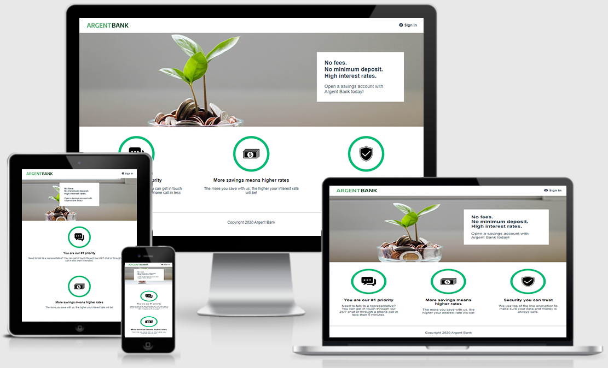

# Projet n°14 : Utiliser une API pour un compte utilisateur bancaire avec React (partie back-end)

## :mag: Aperçu

## :bookmark_tabs: Sommaire

<ol>
    <li><a href="#sujet">Sujet</a></li>
    <li><a href="#demandes_respecter">Demandes à respecter</a></li>
    <li><a href="#objectifs_projet">Objectifs du projet</a></li>
    <li><a href="#technologies_utilisees">Technologies utilisées</a></li>
    <li><a href="#prerequis">Prérequis</a></li>
    <li><a href="#installation">Installation</a></li>
    <li><a href="#utilisation_siteweb">Utilisation du site web</a></li>
    <li><a href="#auteurs_contributeurs">Auteurs et contributeurs</a></li>
    <li><a href="#licence">Licence</a></li>
</ol>

## :page_facing_up: 1. Sujet 

Vous venez de commencer à travailler chez Remede Agency, une agence spécialisée dans le développement d'applications web.

L'équipe est principalement composée de développeurs back-end et vient de commencer à recruter d'autres spécialistes front-end.

Le projet concerne une nouvelle banque qui démarre, Argent Bank, qui essaie de percer dans le secteur et qui a besoin d'aide pour mettre en place son application.

Phase 1 : Authentification des utilisateurs - Création d'une application web permettant aux clients de se connecter et de gérer leurs comptes et leur profil.

Phase 2 : Transactions - Spécifier les endpoints d’API nécessaires pour une éventuelle deuxième mission.

## :memo: 2. Demandes à respecter 

- Faire évoluer l'application web statique qui n'utilise que le HTML et CSS, en une application web dynamique, en utilisant React et React Router ;
- Utiliser Redux ToolKit pour gérer l'état de l'application ;
- Utiliser l'outil Swagger pour retrouver les requêtes API existantes, et la modélisation future de l'API.

## :checkered_flag: 3. Objectifs du projet 

- Apprendre à utiliser React, React Router, Redux ToolKit, Swagger.

## :computer: 4. Technologies utilisées 

- HTML
- CSS / Sass
- JavaScript / React.js
- Swagger
- Git & GitHub

## :exclamation: 5. Prérequis 

- Avoir fait le necéssaire avec la partie back-end disponible ici : https://github.com/LancelleTimote/Projet-n-14-Utiliser-une-API-pour-un-compte-utilisateur-bancaire-avec-React-partie-front-end
- Avoir Node.js v12 d'installer sur son PC.
- Avoir MongoDB d'installer sur son PC.

## :wrench: 6. Installation 

- Cloner ce repository.
- Pour installer les différents packages, dans le terminal à partir du dossier back-end, exécuter npm install.

## :question: 7. Utilisation du site web 

- Dans le terminal à partir du dossier back-end, exécuter npm run dev:server ;
- Toujours dans le terminal à partir du dossier back-end, exécuter npm run populate-db ;
- Dans le terminal à partir du dossier front-end, exécuter npm start ;
- L'application est disponible sur : http://localhost:3000/
- Dans la base de donnée il existe deux utilisateurs :
  Tony Stark
  First Name: Tony
  Last Name: Stark
  Email: tony@stark.com
  Password: password123

  Steve Rogers
  First Name: Steve,
  Last Name: Rogers,
  Email: steve@rogers.com,
  Password: password456

- Une fois que l'environnement local est demarré, pour avoir plus d'informations sur le fonctionnement de l'API, une documentation est disponible ici : http://localhost:3001/api-docs

## :beers: 8. Auteurs et Contributeurs 

Timoté Lancelle : [GitHub](https://github.com/LancelleTimote) / [LinkedIn](https://www.linkedin.com/in/timote-lancelle-devweb/)

## :page_with_curl: 9. Licence 

Distribué sous la licence MIT. Voir le fichier [LICENSE](LICENSE) pour plus d'informations.
